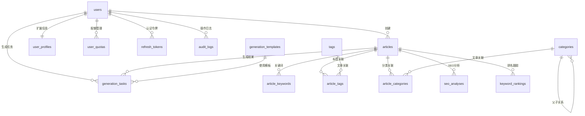

# SEO内容生成平台 - 数据库设计文档

## 📋 数据库概述

本文档详细描述了AI驱动的SEO内容生成平台的数据库设计，包括表结构、关系、索引策略和数据迁移方案。

### 🎯 设计目标

- **可扩展性**: 支持大量用户和文章数据
- **性能优化**: 合理的索引设计和查询优化
- **数据完整性**: 严格的约束和关系设计
- **安全性**: 敏感数据加密和访问控制

### 🛠️ 技术栈

- **数据库**: PostgreSQL 14+
- **ORM**: Prisma
- **迁移工具**: Prisma Migrate
- **备份策略**: 自动化备份 + 增量备份

---

## 🗂️ 核心数据模块

### 1. 用户管理模块

#### users 表 - 用户基础信息

```sql
CREATE TABLE users (
    id UUID PRIMARY KEY DEFAULT gen_random_uuid(),
    email VARCHAR(255) UNIQUE NOT NULL,
    password_hash VARCHAR(255) NOT NULL,
    name VARCHAR(100) NOT NULL,
    avatar_url TEXT,
    plan VARCHAR(20) DEFAULT 'free' CHECK (plan IN ('free', 'pro', 'enterprise')),
    status VARCHAR(20) DEFAULT 'active' CHECK (status IN ('active', 'suspended', 'deleted')),
    email_verified BOOLEAN DEFAULT false,
    email_verified_at TIMESTAMP,
    last_login_at TIMESTAMP,
    created_at TIMESTAMP DEFAULT CURRENT_TIMESTAMP,
    updated_at TIMESTAMP DEFAULT CURRENT_TIMESTAMP
);

-- 索引
CREATE INDEX idx_users_email ON users(email);
CREATE INDEX idx_users_plan ON users(plan);
CREATE INDEX idx_users_status ON users(status);
CREATE INDEX idx_users_created_at ON users(created_at);
```

**字段说明**:
- `id`: 用户唯一标识符 (UUID)
- `email`: 用户邮箱，用于登录
- `password_hash`: 加密后的密码
- `name`: 用户显示名称
- `avatar_url`: 头像URL
- `plan`: 订阅计划 (free/pro/enterprise)
- `status`: 账户状态
- `email_verified`: 邮箱是否已验证

#### user_profiles 表 - 用户扩展信息

```sql
CREATE TABLE user_profiles (
    id UUID PRIMARY KEY DEFAULT gen_random_uuid(),
    user_id UUID NOT NULL REFERENCES users(id) ON DELETE CASCADE,
    company VARCHAR(100),
    website VARCHAR(255),
    bio TEXT,
    timezone VARCHAR(50) DEFAULT 'UTC',
    language VARCHAR(10) DEFAULT 'zh-CN',
    preferences JSONB DEFAULT '{}',
    created_at TIMESTAMP DEFAULT CURRENT_TIMESTAMP,
    updated_at TIMESTAMP DEFAULT CURRENT_TIMESTAMP
);

-- 索引
CREATE UNIQUE INDEX idx_user_profiles_user_id ON user_profiles(user_id);
```

#### user_quotas 表 - 用户配额管理

```sql
CREATE TABLE user_quotas (
    id UUID PRIMARY KEY DEFAULT gen_random_uuid(),
    user_id UUID NOT NULL REFERENCES users(id) ON DELETE CASCADE,
    quota_type VARCHAR(50) NOT NULL, -- 'articles', 'generations', 'api_calls'
    used_count INTEGER DEFAULT 0,
    limit_count INTEGER NOT NULL,
    reset_period VARCHAR(20) DEFAULT 'monthly', -- 'daily', 'weekly', 'monthly', 'yearly'
    last_reset_at TIMESTAMP DEFAULT CURRENT_TIMESTAMP,
    next_reset_at TIMESTAMP NOT NULL,
    created_at TIMESTAMP DEFAULT CURRENT_TIMESTAMP,
    updated_at TIMESTAMP DEFAULT CURRENT_TIMESTAMP
);

-- 索引
CREATE UNIQUE INDEX idx_user_quotas_user_type ON user_quotas(user_id, quota_type);
CREATE INDEX idx_user_quotas_next_reset ON user_quotas(next_reset_at);
```

### 2. 内容管理模块

#### articles 表 - 文章主表

```sql
CREATE TABLE articles (
    id UUID PRIMARY KEY DEFAULT gen_random_uuid(),
    user_id UUID NOT NULL REFERENCES users(id) ON DELETE CASCADE,
    title VARCHAR(500) NOT NULL,
    content TEXT NOT NULL,
    excerpt TEXT,
    type VARCHAR(50) NOT NULL CHECK (type IN ('review', 'top_list', 'comparison', 'guide', 'news')),
    status VARCHAR(20) DEFAULT 'draft' CHECK (status IN ('draft', 'published', 'archived', 'deleted')),
    
    -- SEO相关字段
    meta_title VARCHAR(60),
    meta_description VARCHAR(160),
    slug VARCHAR(255) UNIQUE,
    
    -- 统计字段
    word_count INTEGER DEFAULT 0,
    reading_time INTEGER DEFAULT 0, -- 分钟
    seo_score INTEGER DEFAULT 0 CHECK (seo_score >= 0 AND seo_score <= 100),
    
    -- 发布相关
    published_at TIMESTAMP,
    scheduled_at TIMESTAMP,
    
    -- 时间戳
    created_at TIMESTAMP DEFAULT CURRENT_TIMESTAMP,
    updated_at TIMESTAMP DEFAULT CURRENT_TIMESTAMP
);

-- 索引
CREATE INDEX idx_articles_user_id ON articles(user_id);
CREATE INDEX idx_articles_type ON articles(type);
CREATE INDEX idx_articles_status ON articles(status);
CREATE INDEX idx_articles_published_at ON articles(published_at);
CREATE INDEX idx_articles_created_at ON articles(created_at);
CREATE INDEX idx_articles_seo_score ON articles(seo_score);
CREATE INDEX idx_articles_slug ON articles(slug) WHERE slug IS NOT NULL;
```

#### article_keywords 表 - 文章关键词

```sql
CREATE TABLE article_keywords (
    id UUID PRIMARY KEY DEFAULT gen_random_uuid(),
    article_id UUID NOT NULL REFERENCES articles(id) ON DELETE CASCADE,
    keyword VARCHAR(100) NOT NULL,
    density DECIMAL(5,2) DEFAULT 0.00, -- 关键词密度百分比
    is_primary BOOLEAN DEFAULT false, -- 是否为主关键词
    created_at TIMESTAMP DEFAULT CURRENT_TIMESTAMP
);

-- 索引
CREATE INDEX idx_article_keywords_article_id ON article_keywords(article_id);
CREATE INDEX idx_article_keywords_keyword ON article_keywords(keyword);
CREATE INDEX idx_article_keywords_primary ON article_keywords(is_primary) WHERE is_primary = true;
```

#### article_tags 表 - 文章标签

```sql
CREATE TABLE tags (
    id UUID PRIMARY KEY DEFAULT gen_random_uuid(),
    name VARCHAR(50) UNIQUE NOT NULL,
    slug VARCHAR(50) UNIQUE NOT NULL,
    description TEXT,
    color VARCHAR(7) DEFAULT '#1890ff', -- 十六进制颜色
    usage_count INTEGER DEFAULT 0,
    created_at TIMESTAMP DEFAULT CURRENT_TIMESTAMP
);

CREATE TABLE article_tags (
    article_id UUID NOT NULL REFERENCES articles(id) ON DELETE CASCADE,
    tag_id UUID NOT NULL REFERENCES tags(id) ON DELETE CASCADE,
    created_at TIMESTAMP DEFAULT CURRENT_TIMESTAMP,
    PRIMARY KEY (article_id, tag_id)
);

-- 索引
CREATE INDEX idx_tags_name ON tags(name);
CREATE INDEX idx_tags_usage_count ON tags(usage_count);
CREATE INDEX idx_article_tags_article_id ON article_tags(article_id);
CREATE INDEX idx_article_tags_tag_id ON article_tags(tag_id);
```

#### categories 表 - 文章分类

```sql
CREATE TABLE categories (
    id UUID PRIMARY KEY DEFAULT gen_random_uuid(),
    name VARCHAR(100) NOT NULL,
    slug VARCHAR(100) UNIQUE NOT NULL,
    description TEXT,
    parent_id UUID REFERENCES categories(id),
    sort_order INTEGER DEFAULT 0,
    is_active BOOLEAN DEFAULT true,
    created_at TIMESTAMP DEFAULT CURRENT_TIMESTAMP,
    updated_at TIMESTAMP DEFAULT CURRENT_TIMESTAMP
);

CREATE TABLE article_categories (
    article_id UUID NOT NULL REFERENCES articles(id) ON DELETE CASCADE,
    category_id UUID NOT NULL REFERENCES categories(id) ON DELETE CASCADE,
    created_at TIMESTAMP DEFAULT CURRENT_TIMESTAMP,
    PRIMARY KEY (article_id, category_id)
);

-- 索引
CREATE INDEX idx_categories_parent_id ON categories(parent_id);
CREATE INDEX idx_categories_slug ON categories(slug);
CREATE INDEX idx_article_categories_article_id ON article_categories(article_id);
CREATE INDEX idx_article_categories_category_id ON article_categories(category_id);
```

### 3. AI生成模块

#### generation_tasks 表 - AI生成任务

```sql
CREATE TABLE generation_tasks (
    id UUID PRIMARY KEY DEFAULT gen_random_uuid(),
    user_id UUID NOT NULL REFERENCES users(id) ON DELETE CASCADE,
    task_type VARCHAR(50) NOT NULL CHECK (task_type IN ('review', 'top_list', 'comparison', 'guide')),
    status VARCHAR(20) DEFAULT 'pending' CHECK (status IN ('pending', 'processing', 'completed', 'failed', 'cancelled')),
    
    -- 生成参数
    input_params JSONB NOT NULL,
    
    -- 结果
    result_article_id UUID REFERENCES articles(id),
    error_message TEXT,
    
    -- 统计信息
    processing_time INTEGER, -- 秒
    tokens_used INTEGER,
    cost_amount DECIMAL(10,4), -- 成本（美元）
    
    -- 时间戳
    started_at TIMESTAMP,
    completed_at TIMESTAMP,
    created_at TIMESTAMP DEFAULT CURRENT_TIMESTAMP,
    updated_at TIMESTAMP DEFAULT CURRENT_TIMESTAMP
);

-- 索引
CREATE INDEX idx_generation_tasks_user_id ON generation_tasks(user_id);
CREATE INDEX idx_generation_tasks_status ON generation_tasks(status);
CREATE INDEX idx_generation_tasks_type ON generation_tasks(task_type);
CREATE INDEX idx_generation_tasks_created_at ON generation_tasks(created_at);
```

#### generation_templates 表 - 生成模板

```sql
CREATE TABLE generation_templates (
    id UUID PRIMARY KEY DEFAULT gen_random_uuid(),
    name VARCHAR(100) NOT NULL,
    type VARCHAR(50) NOT NULL,
    description TEXT,
    prompt_template TEXT NOT NULL,
    default_params JSONB DEFAULT '{}',
    is_active BOOLEAN DEFAULT true,
    usage_count INTEGER DEFAULT 0,
    created_by UUID REFERENCES users(id),
    created_at TIMESTAMP DEFAULT CURRENT_TIMESTAMP,
    updated_at TIMESTAMP DEFAULT CURRENT_TIMESTAMP
);

-- 索引
CREATE INDEX idx_generation_templates_type ON generation_templates(type);
CREATE INDEX idx_generation_templates_active ON generation_templates(is_active);
```

### 4. SEO分析模块

#### seo_analyses 表 - SEO分析结果

```sql
CREATE TABLE seo_analyses (
    id UUID PRIMARY KEY DEFAULT gen_random_uuid(),
    article_id UUID NOT NULL REFERENCES articles(id) ON DELETE CASCADE,
    overall_score INTEGER NOT NULL CHECK (overall_score >= 0 AND overall_score <= 100),
    
    -- 各项评分
    title_score INTEGER CHECK (title_score >= 0 AND title_score <= 100),
    meta_description_score INTEGER CHECK (meta_description_score >= 0 AND meta_description_score <= 100),
    keyword_score INTEGER CHECK (keyword_score >= 0 AND keyword_score <= 100),
    content_score INTEGER CHECK (content_score >= 0 AND content_score <= 100),
    structure_score INTEGER CHECK (structure_score >= 0 AND structure_score <= 100),
    readability_score INTEGER CHECK (readability_score >= 0 AND readability_score <= 100),
    
    -- 详细分析结果
    analysis_details JSONB NOT NULL,
    recommendations JSONB DEFAULT '[]',
    
    -- 分析版本
    analyzer_version VARCHAR(20) DEFAULT '1.0',
    
    created_at TIMESTAMP DEFAULT CURRENT_TIMESTAMP
);

-- 索引
CREATE INDEX idx_seo_analyses_article_id ON seo_analyses(article_id);
CREATE INDEX idx_seo_analyses_overall_score ON seo_analyses(overall_score);
CREATE INDEX idx_seo_analyses_created_at ON seo_analyses(created_at);
```

#### keyword_rankings 表 - 关键词排名跟踪

```sql
CREATE TABLE keyword_rankings (
    id UUID PRIMARY KEY DEFAULT gen_random_uuid(),
    article_id UUID NOT NULL REFERENCES articles(id) ON DELETE CASCADE,
    keyword VARCHAR(100) NOT NULL,
    search_engine VARCHAR(20) DEFAULT 'google' CHECK (search_engine IN ('google', 'baidu', 'bing')),
    ranking_position INTEGER,
    search_volume INTEGER,
    competition_level VARCHAR(10) CHECK (competition_level IN ('low', 'medium', 'high')),
    tracked_date DATE NOT NULL,
    created_at TIMESTAMP DEFAULT CURRENT_TIMESTAMP
);

-- 索引
CREATE INDEX idx_keyword_rankings_article_id ON keyword_rankings(article_id);
CREATE INDEX idx_keyword_rankings_keyword ON keyword_rankings(keyword);
CREATE INDEX idx_keyword_rankings_date ON keyword_rankings(tracked_date);
CREATE UNIQUE INDEX idx_keyword_rankings_unique ON keyword_rankings(article_id, keyword, search_engine, tracked_date);
```

### 5. 系统管理模块

#### refresh_tokens 表 - 刷新令牌

```sql
CREATE TABLE refresh_tokens (
    id UUID PRIMARY KEY DEFAULT gen_random_uuid(),
    user_id UUID NOT NULL REFERENCES users(id) ON DELETE CASCADE,
    token_hash VARCHAR(255) NOT NULL,
    expires_at TIMESTAMP NOT NULL,
    is_revoked BOOLEAN DEFAULT false,
    device_info JSONB,
    created_at TIMESTAMP DEFAULT CURRENT_TIMESTAMP
);

-- 索引
CREATE INDEX idx_refresh_tokens_user_id ON refresh_tokens(user_id);
CREATE INDEX idx_refresh_tokens_expires_at ON refresh_tokens(expires_at);
CREATE INDEX idx_refresh_tokens_revoked ON refresh_tokens(is_revoked);
```

#### audit_logs 表 - 操作审计日志

```sql
CREATE TABLE audit_logs (
    id UUID PRIMARY KEY DEFAULT gen_random_uuid(),
    user_id UUID REFERENCES users(id),
    action VARCHAR(100) NOT NULL,
    resource_type VARCHAR(50) NOT NULL,
    resource_id UUID,
    old_values JSONB,
    new_values JSONB,
    ip_address INET,
    user_agent TEXT,
    created_at TIMESTAMP DEFAULT CURRENT_TIMESTAMP
);

-- 索引
CREATE INDEX idx_audit_logs_user_id ON audit_logs(user_id);
CREATE INDEX idx_audit_logs_action ON audit_logs(action);
CREATE INDEX idx_audit_logs_resource ON audit_logs(resource_type, resource_id);
CREATE INDEX idx_audit_logs_created_at ON audit_logs(created_at);
```

#### system_settings 表 - 系统配置

```sql
CREATE TABLE system_settings (
    id UUID PRIMARY KEY DEFAULT gen_random_uuid(),
    key VARCHAR(100) UNIQUE NOT NULL,
    value JSONB NOT NULL,
    description TEXT,
    is_public BOOLEAN DEFAULT false,
    created_at TIMESTAMP DEFAULT CURRENT_TIMESTAMP,
    updated_at TIMESTAMP DEFAULT CURRENT_TIMESTAMP
);

-- 索引
CREATE INDEX idx_system_settings_key ON system_settings(key);
CREATE INDEX idx_system_settings_public ON system_settings(is_public);
```

---

## 🔗 表关系图



---

## 📊 索引策略

### 主要查询模式分析

1. **用户相关查询**
   - 按邮箱查找用户 (登录)
   - 按用户ID查找文章列表
   - 按订阅计划统计用户

2. **文章相关查询**
   - 按用户ID分页查询文章
   - 按类型和状态筛选文章
   - 按创建时间排序
   - 按SEO评分排序

3. **SEO分析查询**
   - 按文章ID查找最新分析
   - 按评分范围统计
   - 按时间范围分析趋势

### 复合索引设计

```sql
-- 文章查询优化
CREATE INDEX idx_articles_user_status_type ON articles(user_id, status, type);
CREATE INDEX idx_articles_user_created ON articles(user_id, created_at DESC);
CREATE INDEX idx_articles_published_score ON articles(status, seo_score DESC) WHERE status = 'published';

-- 生成任务查询优化
CREATE INDEX idx_generation_tasks_user_status ON generation_tasks(user_id, status);
CREATE INDEX idx_generation_tasks_type_created ON generation_tasks(task_type, created_at DESC);

-- SEO分析查询优化
CREATE INDEX idx_seo_analyses_article_latest ON seo_analyses(article_id, created_at DESC);

-- 关键词排名查询优化
CREATE INDEX idx_keyword_rankings_keyword_date ON keyword_rankings(keyword, tracked_date DESC);
```

---

## 🗃️ Prisma Schema定义

```prisma
// prisma/schema.prisma
generator client {
  provider = "prisma-client-js"
}

datasource db {
  provider = "postgresql"
  url      = env("DATABASE_URL")
}

// 用户模型
model User {
  id              String    @id @default(dbgenerated("gen_random_uuid()")) @db.Uuid
  email           String    @unique @db.VarChar(255)
  passwordHash    String    @map("password_hash") @db.VarChar(255)
  name            String    @db.VarChar(100)
  avatarUrl       String?   @map("avatar_url")
  plan            Plan      @default(FREE)
  status          UserStatus @default(ACTIVE)
  emailVerified   Boolean   @default(false) @map("email_verified")
  emailVerifiedAt DateTime? @map("email_verified_at")
  lastLoginAt     DateTime? @map("last_login_at")
  createdAt       DateTime  @default(now()) @map("created_at")
  updatedAt       DateTime  @updatedAt @map("updated_at")

  // 关联关系
  profile         UserProfile?
  quotas          UserQuota[]
  articles        Article[]
  generationTasks GenerationTask[]
  refreshTokens   RefreshToken[]
  auditLogs       AuditLog[]

  @@map("users")
}

model UserProfile {
  id          String   @id @default(dbgenerated("gen_random_uuid()")) @db.Uuid
  userId      String   @unique @map("user_id") @db.Uuid
  company     String?  @db.VarChar(100)
  website     String?  @db.VarChar(255)
  bio         String?
  timezone    String   @default("UTC") @db.VarChar(50)
  language    String   @default("zh-CN") @db.VarChar(10)
  preferences Json     @default("{}")
  createdAt   DateTime @default(now()) @map("created_at")
  updatedAt   DateTime @updatedAt @map("updated_at")

  user User @relation(fields: [userId], references: [id], onDelete: Cascade)

  @@map("user_profiles")
}

model UserQuota {
  id          String      @id @default(dbgenerated("gen_random_uuid()")) @db.Uuid
  userId      String      @map("user_id") @db.Uuid
  quotaType   String      @map("quota_type") @db.VarChar(50)
  usedCount   Int         @default(0) @map("used_count")
  limitCount  Int         @map("limit_count")
  resetPeriod ResetPeriod @default(MONTHLY) @map("reset_period")
  lastResetAt DateTime    @default(now()) @map("last_reset_at")
  nextResetAt DateTime    @map("next_reset_at")
  createdAt   DateTime    @default(now()) @map("created_at")
  updatedAt   DateTime    @updatedAt @map("updated_at")

  user User @relation(fields: [userId], references: [id], onDelete: Cascade)

  @@unique([userId, quotaType])
  @@map("user_quotas")
}

// 文章模型
model Article {
  id            String        @id @default(dbgenerated("gen_random_uuid()")) @db.Uuid
  userId        String        @map("user_id") @db.Uuid
  title         String        @db.VarChar(500)
  content       String
  excerpt       String?
  type          ArticleType
  status        ArticleStatus @default(DRAFT)
  metaTitle     String?       @map("meta_title") @db.VarChar(60)
  metaDescription String?     @map("meta_description") @db.VarChar(160)
  slug          String?       @unique @db.VarChar(255)
  wordCount     Int           @default(0) @map("word_count")
  readingTime   Int           @default(0) @map("reading_time")
  seoScore      Int           @default(0) @map("seo_score")
  publishedAt   DateTime?     @map("published_at")
  scheduledAt   DateTime?     @map("scheduled_at")
  createdAt     DateTime      @default(now()) @map("created_at")
  updatedAt     DateTime      @updatedAt @map("updated_at")

  // 关联关系
  user            User              @relation(fields: [userId], references: [id], onDelete: Cascade)
  keywords        ArticleKeyword[]
  tags            ArticleTag[]
  categories      ArticleCategory[]
  seoAnalyses     SeoAnalysis[]
  keywordRankings KeywordRanking[]
  generationTasks GenerationTask[]

  @@map("articles")
}

model ArticleKeyword {
  id        String   @id @default(dbgenerated("gen_random_uuid()")) @db.Uuid
  articleId String   @map("article_id") @db.Uuid
  keyword   String   @db.VarChar(100)
  density   Decimal  @default(0.00) @db.Decimal(5, 2)
  isPrimary Boolean  @default(false) @map("is_primary")
  createdAt DateTime @default(now()) @map("created_at")

  article Article @relation(fields: [articleId], references: [id], onDelete: Cascade)

  @@map("article_keywords")
}

model Tag {
  id          String       @id @default(dbgenerated("gen_random_uuid()")) @db.Uuid
  name        String       @unique @db.VarChar(50)
  slug        String       @unique @db.VarChar(50)
  description String?
  color       String       @default("#1890ff") @db.VarChar(7)
  usageCount  Int          @default(0) @map("usage_count")
  createdAt   DateTime     @default(now()) @map("created_at")

  articles ArticleTag[]

  @@map("tags")
}

model ArticleTag {
  articleId String   @map("article_id") @db.Uuid
  tagId     String   @map("tag_id") @db.Uuid
  createdAt DateTime @default(now()) @map("created_at")

  article Article @relation(fields: [articleId], references: [id], onDelete: Cascade)
  tag     Tag     @relation(fields: [tagId], references: [id], onDelete: Cascade)

  @@id([articleId, tagId])
  @@map("article_tags")
}

// 枚举定义
enum Plan {
  FREE
  PRO
  ENTERPRISE
}

enum UserStatus {
  ACTIVE
  SUSPENDED
  DELETED
}

enum ResetPeriod {
  DAILY
  WEEKLY
  MONTHLY
  YEARLY
}

enum ArticleType {
  REVIEW
  TOP_LIST
  COMPARISON
  GUIDE
  NEWS
}

enum ArticleStatus {
  DRAFT
  PUBLISHED
  ARCHIVED
  DELETED
}

enum TaskStatus {
  PENDING
  PROCESSING
  COMPLETED
  FAILED
  CANCELLED
}
```

---

## 🔄 数据库迁移

### 初始化迁移

```bash
# 创建初始迁移
npx prisma migrate dev --name init

# 生成Prisma客户端
npx prisma generate

# 查看迁移状态
npx prisma migrate status
```

### 迁移脚本示例

```sql
-- 001_create_users_table.sql
CREATE EXTENSION IF NOT EXISTS "uuid-ossp";

CREATE TABLE users (
    id UUID PRIMARY KEY DEFAULT gen_random_uuid(),
    email VARCHAR(255) UNIQUE NOT NULL,
    password_hash VARCHAR(255) NOT NULL,
    name VARCHAR(100) NOT NULL,
    plan VARCHAR(20) DEFAULT 'free',
    status VARCHAR(20) DEFAULT 'active',
    created_at TIMESTAMP DEFAULT CURRENT_TIMESTAMP,
    updated_at TIMESTAMP DEFAULT CURRENT_TIMESTAMP
);

-- 002_create_articles_table.sql
CREATE TABLE articles (
    id UUID PRIMARY KEY DEFAULT gen_random_uuid(),
    user_id UUID NOT NULL REFERENCES users(id) ON DELETE CASCADE,
    title VARCHAR(500) NOT NULL,
    content TEXT NOT NULL,
    type VARCHAR(50) NOT NULL,
    status VARCHAR(20) DEFAULT 'draft',
    created_at TIMESTAMP DEFAULT CURRENT_TIMESTAMP,
    updated_at TIMESTAMP DEFAULT CURRENT_TIMESTAMP
);

CREATE INDEX idx_articles_user_id ON articles(user_id);
CREATE INDEX idx_articles_status ON articles(status);
```

---

## 🌱 数据初始化

### 种子数据脚本

```javascript
// prisma/seed.js
const { PrismaClient } = require('@prisma/client')
const bcrypt = require('bcryptjs')

const prisma = new PrismaClient()

async function main() {
  console.log('开始初始化数据...')

  // 创建管理员用户
  const adminPassword = await bcrypt.hash('admin123456', 12)
  const admin = await prisma.user.upsert({
    where: { email: 'admin@seoer-platform.com' },
    update: {},
    create: {
      email: 'admin@seoer-platform.com',
      passwordHash: adminPassword,
      name: '系统管理员',
      plan: 'ENTERPRISE',
      emailVerified: true,
      emailVerifiedAt: new Date(),
      profile: {
        create: {
          company: 'SEO内容平台',
          bio: '系统管理员账户',
          timezone: 'Asia/Shanghai',
          language: 'zh-CN'
        }
      }
    }
  })

  // 创建测试用户
  const testPassword = await bcrypt.hash('test123456', 12)
  const testUser = await prisma.user.upsert({
    where: { email: 'test@example.com' },
    update: {},
    create: {
      email: 'test@example.com',
      passwordHash: testPassword,
      name: '测试用户',
      plan: 'PRO',
      emailVerified: true,
      profile: {
        create: {
          company: '测试公司',
          bio: '这是一个测试用户账户',
          timezone: 'Asia/Shanghai'
        }
      }
    }
  })

  // 创建用户配额
  await prisma.userQuota.createMany({
    data: [
      {
        userId: admin.id,
        quotaType: 'articles',
        usedCount: 0,
        limitCount: -1, // 无限制
        nextResetAt: new Date(Date.now() + 30 * 24 * 60 * 60 * 1000)
      },
      {
        userId: testUser.id,
        quotaType: 'articles',
        usedCount: 5,
        limitCount: 500,
        nextResetAt: new Date(Date.now() + 30 * 24 * 60 * 60 * 1000)
      }
    ]
  })

  // 创建默认标签
  const tags = await prisma.tag.createMany({
    data: [
      { name: '数码评测', slug: 'digital-review', color: '#1890ff' },
      { name: '智能手机', slug: 'smartphone', color: '#52c41a' },
      { name: '笔记本电脑', slug: 'laptop', color: '#faad14' },
      { name: '家电产品', slug: 'home-appliance', color: '#f5222d' },
      { name: '软件工具', slug: 'software-tool', color: '#722ed1' }
    ]
  })

  // 创建默认分类
  const categories = await prisma.category.createMany({
    data: [
      { name: '数码科技', slug: 'digital-tech', description: '数码产品和科技资讯' },
      { name: '生活家居', slug: 'lifestyle', description: '生活用品和家居产品' },
      { name: '软件应用', slug: 'software', description: '软件工具和应用推荐' },
      { name: '游戏娱乐', slug: 'gaming', description: '游戏和娱乐产品' }
    ]
  })

  // 创建生成模板
  await prisma.generationTemplate.createMany({
    data: [
      {
        name: '产品评测模板',
        type: 'REVIEW',
        description: '标准的产品评测文章模板',
        promptTemplate: `请为产品 "{{productName}}" 写一篇详细的评测文章。

要求：
1. 文章长度：{{length}}
2. 写作风格：{{tone}}
3. 重点关注：{{focusAreas}}
4. 目标关键词：{{keywords}}

请按照以下结构组织文章：
- 产品概述
- 外观设计
- 功能特性
- 性能表现
- 优缺点分析
- 购买建议`,
        defaultParams: {
          length: 'detailed',
          tone: 'professional',
          focusAreas: ['性能', '设计', '价格']
        },
        isActive: true
      },
      {
        name: '十大列表模板',
        type: 'TOP_LIST',
        description: '十大推荐列表文章模板',
        promptTemplate: `请创建一个关于 "{{listTitle}}" 的十大推荐列表。

要求：
1. 列出10个推荐项目
2. 每个项目包含详细介绍
3. 按照 {{criteria}} 进行排序
4. 包含价格信息：{{priceRange}}
5. 目标关键词：{{keywords}}

文章结构：
- 引言
- 选择标准说明
- 十大推荐列表（每项包含特点、优势、价格）
- 总结建议`,
        defaultParams: {
          criteria: ['性能', '价格', '用户评价'],
          includeSpecs: true,
          includePricing: true
        },
        isActive: true
      }
    ]
  })

  // 创建系统设置
  await prisma.systemSetting.createMany({
    data: [
      {
        key: 'site_name',
        value: '"SEO内容生成平台"',
        description: '网站名称',
        isPublic: true
      },
      {
        key: 'default_seo_score_threshold',
        value: '80',
        description: '默认SEO评分阈值',
        isPublic: false
      },
      {
        key: 'max_article_length',
        value: '50000',
        description: '文章最大长度（字符）',
        isPublic: false
      },
      {
        key: 'ai_generation_timeout',
        value: '300',
        description: 'AI生成超时时间（秒）',
        isPublic: false
      }
    ]
  })

  console.log('数据初始化完成！')
  console.log('管理员账户：admin@seoer-platform.com / admin123456')
  console.log('测试账户：test@example.com / test123456')
}

main()
  .catch((e) => {
    console.error(e)
    process.exit(1)
  })
  .finally(async () => {
    await prisma.$disconnect()
  })
```

### 运行种子数据

```bash
# 运行种子脚本
npx prisma db seed

# 或者直接运行
node prisma/seed.js
```

---

## 🔍 查询优化示例

### 常用查询模式

```sql
-- 1. 获取用户的文章列表（分页）
SELECT 
    a.id,
    a.title,
    a.type,
    a.status,
    a.seo_score,
    a.created_at,
    COUNT(ak.id) as keyword_count
FROM articles a
LEFT JOIN article_keywords ak ON a.id = ak.article_id
WHERE a.user_id = $1 
    AND a.status != 'deleted'
GROUP BY a.id
ORDER BY a.created_at DESC
LIMIT $2 OFFSET $3;

-- 2. 获取文章详情（包含关联数据）
SELECT 
    a.*,
    u.name as author_name,
    sa.overall_score as latest_seo_score
FROM articles a
JOIN users u ON a.user_id = u.id
LEFT JOIN LATERAL (
    SELECT overall_score 
    FROM seo_analyses 
    WHERE article_id = a.id 
    ORDER BY created_at DESC 
    LIMIT 1
) sa ON true
WHERE a.id = $1;

-- 3. 统计用户数据
SELECT 
    COUNT(*) as total_articles,
    COUNT(CASE WHEN status = 'published' THEN 1 END) as published_count,
    AVG(seo_score) as avg_seo_score,
    SUM(word_count) as total_words
FROM articles 
WHERE user_id = $1 AND status != 'deleted';

-- 4. 热门关键词统计
SELECT 
    ak.keyword,
    COUNT(*) as usage_count,
    AVG(a.seo_score) as avg_seo_score
FROM article_keywords ak
JOIN articles a ON ak.article_id = a.id
WHERE a.status = 'published'
    AND a.created_at >= NOW() - INTERVAL '30 days'
GROUP BY ak.keyword
HAVING COUNT(*) >= 3
ORDER BY usage_count DESC, avg_seo_score DESC
LIMIT 20;
```

### 性能优化建议

1. **使用连接池**
```javascript
// lib/prisma.ts
import { PrismaClient } from '@prisma/client'

const globalForPrisma = globalThis as unknown as {
  prisma: PrismaClient | undefined
}

export const prisma = globalForPrisma.prisma ?? new PrismaClient({
  log: ['query', 'error', 'warn'],
  datasources: {
    db: {
      url: process.env.DATABASE_URL
    }
  }
})

if (process.env.NODE_ENV !== 'production') globalForPrisma.prisma = prisma
```

2. **查询优化**
```javascript
// 使用select减少数据传输
const articles = await prisma.article.findMany({
  select: {
    id: true,
    title: true,
    status: true,
    createdAt: true,
    user: {
      select: {
        name: true
      }
    }
  },
  where: {
    userId: userId,
    status: {
      not: 'DELETED'
    }
  },
  orderBy: {
    createdAt: 'desc'
  },
  take: 20,
  skip: (page - 1) * 20
})

// 使用include预加载关联数据
const articleWithDetails = await prisma.article.findUnique({
  where: { id: articleId },
  include: {
    keywords: true,
    tags: {
      include: {
        tag: true
      }
    },
    seoAnalyses: {
      orderBy: {
        createdAt: 'desc'
      },
      take: 1
    }
  }
})
```

---

## 🔒 数据安全

### 备份策略

```bash
#!/bin/bash
# backup.sh - 数据库备份脚本

DATE=$(date +"%Y%m%d_%H%M%S")
BACKUP_DIR="/backups/postgresql"
DB_NAME="seoer_db"

# 创建备份目录
mkdir -p $BACKUP_DIR

# 全量备份
pg_dump -h localhost -U postgres -d $DB_NAME > $BACKUP_DIR/full_backup_$DATE.sql

# 压缩备份文件
gzip $BACKUP_DIR/full_backup_$DATE.sql

# 删除7天前的备份
find $BACKUP_DIR -name "*.gz" -mtime +7 -delete

echo "备份完成: full_backup_$DATE.sql.gz"
```

### 数据加密

```sql
-- 启用数据加密扩展
CREATE EXTENSION IF NOT EXISTS pgcrypto;

-- 敏感数据加密存储
CREATE OR REPLACE FUNCTION encrypt_sensitive_data(data TEXT)
RETURNS TEXT AS $$
BEGIN
    RETURN encode(encrypt(data::bytea, 'encryption_key', 'aes'), 'base64');
END;
$$ LANGUAGE plpgsql;

-- 解密函数
CREATE OR REPLACE FUNCTION decrypt_sensitive_data(encrypted_data TEXT)
RETURNS TEXT AS $$
BEGIN
    RETURN convert_from(decrypt(decode(encrypted_data, 'base64'), 'encryption_key', 'aes'), 'UTF8');
END;
$$ LANGUAGE plpgsql;
```

### 访问控制

```sql
-- 创建只读用户
CREATE USER readonly_user WITH PASSWORD 'readonly_password';
GRANT CONNECT ON DATABASE seoer_db TO readonly_user;
GRANT USAGE ON SCHEMA public TO readonly_user;
GRANT SELECT ON ALL TABLES IN SCHEMA public TO readonly_user;

-- 创建应用用户
CREATE USER app_user WITH PASSWORD 'app_password';
GRANT CONNECT ON DATABASE seoer_db TO app_user;
GRANT USAGE ON SCHEMA public TO app_user;
GRANT SELECT, INSERT, UPDATE, DELETE ON ALL TABLES IN SCHEMA public TO app_user;
GRANT USAGE ON ALL SEQUENCES IN SCHEMA public TO app_user;
```

---

## 📞 技术支持

### 数据库监控

```sql
-- 查看活跃连接
SELECT 
    pid,
    usename,
    application_name,
    client_addr,
    state,
    query_start,
    query
FROM pg_stat_activity 
WHERE state = 'active';

-- 查看表大小
SELECT 
    schemaname,
    tablename,
    pg_size_pretty(pg_total_relation_size(schemaname||'.'||tablename)) as size
FROM pg_tables 
WHERE schemaname = 'public'
ORDER BY pg_total_relation_size(schemaname||'.'||tablename) DESC;

-- 查看慢查询
SELECT 
    query,
    calls,
    total_time,
    mean_time,
    rows
FROM pg_stat_statements 
ORDER BY mean_time DESC 
LIMIT 10;
```

### 故障排查

1. **连接问题**
```bash
# 检查PostgreSQL状态
sudo systemctl status postgresql

# 查看日志
sudo tail -f /var/log/postgresql/postgresql-14-main.log

# 测试连接
psql -h localhost -U postgres -d seoer_db -c "SELECT version();"
```

2. **性能问题**
```sql
-- 分析查询计划
EXPLAIN ANALYZE SELECT * FROM articles WHERE user_id = 'uuid';

-- 查看索引使用情况
SELECT 
    schemaname,
    tablename,
    indexname,
    idx_scan,
    idx_tup_read,
    idx_tup_fetch
FROM pg_stat_user_indexes
ORDER BY idx_scan DESC;
```

### 联系方式

- **数据库管理**: dba@seoer-platform.com
- **技术支持**: tech-support@seoer-platform.com
- **紧急联系**: +86-xxx-xxxx-xxxx

---

*数据库设计文档最后更新时间: 2024-01-15*  
*文档版本: v1.0.0*