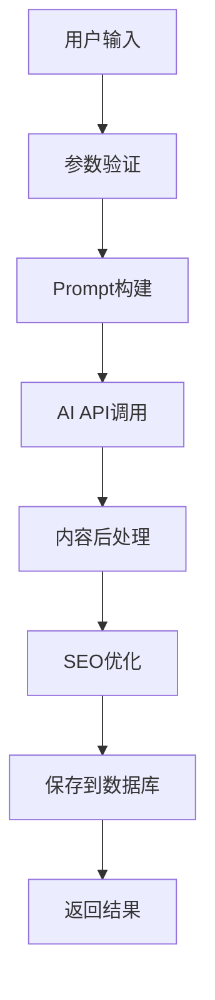

# SEO内容生成平台 - 开发文档

## 📋 项目概述

**项目名称**: AI驱动的SEO内容生成平台  
**项目类型**: Web应用程序  
**开发框架**: Next.js + React + Node.js  
**目标用户**: 内容创作者、SEO专家、营销团队、博客作者  

### 🎯 项目目标

构建一个智能化的SEO内容生成平台，利用AI技术自动化生成高质量、SEO优化的网站评测文章和"十大"列表文章，帮助用户快速创建专业的内容营销材料。

### ✨ 核心价值

- **效率提升**: 将传统1-2天的文章创作时间缩短至10-30分钟
- **质量保证**: AI生成内容结合SEO最佳实践，确保内容质量
- **成本降低**: 减少人工写作成本，提高内容产出ROI
- **规模化**: 支持批量生成，满足大规模内容需求

---

## 🏗️ 技术架构

### 前端技术栈

```
前端架构
├── Next.js 15          # React全栈框架
├── React 19            # 用户界面库
├── Ant Design 5        # UI组件库
├── Tailwind CSS 4      # 样式框架
├── TypeScript          # 类型安全
└── Zustand            # 状态管理
```

### 后端技术栈

```
后端架构
├── Node.js            # 运行环境
├── Next.js API Routes # API路由
├── Prisma ORM         # 数据库ORM
├── PostgreSQL         # 主数据库
├── Redis              # 缓存和会话
└── JWT                # 身份认证
```

### AI集成

```
AI服务
├── OpenAI GPT-4       # 主要内容生成
├── Claude API         # 备选AI模型
├── 自定义Prompt       # 优化生成质量
└── 内容后处理         # SEO优化处理
```

---

## 🎨 核心功能模块

### 1. 用户管理模块

**功能描述**: 完整的用户生命周期管理

**主要功能**:
- 用户注册/登录/登出
- 邮箱验证和密码重置
- 用户资料管理
- 订阅计划管理
- 使用统计和配额管理

**技术实现**:
```typescript
// 用户认证服务
class AuthService {
  async register(userData: RegisterData): Promise<User>
  async login(credentials: LoginData): Promise<AuthResult>
  async refreshToken(token: string): Promise<string>
  async resetPassword(email: string): Promise<void>
}
```

### 2. AI内容生成模块

**功能描述**: 核心AI内容生成引擎

**支持的内容类型**:
- 📝 产品评测文章
- 📊 十大推荐列表
- ⚖️ 产品对比文章
- 📖 使用指南文章
- 📰 新闻资讯文章

**生成流程**:


**技术实现**:
```typescript
// AI内容生成服务
class ContentGenerationService {
  async generateReview(params: ReviewParams): Promise<Article>
  async generateTopList(params: TopListParams): Promise<Article>
  async generateComparison(params: ComparisonParams): Promise<Article>
  async generateGuide(params: GuideParams): Promise<Article>
}
```

### 3. 文章管理模块

**功能描述**: 文章的全生命周期管理

**主要功能**:
- 文章创建、编辑、删除
- 文章分类和标签管理
- 文章发布状态管理
- 批量操作和导入导出
- 文章搜索和筛选

**数据模型**:
```typescript
interface Article {
  id: string
  title: string
  content: string
  type: ArticleType
  status: ArticleStatus
  seoScore: number
  keywords: string[]
  tags: Tag[]
  categories: Category[]
  createdAt: Date
  updatedAt: Date
}
```

### 4. SEO分析模块

**功能描述**: 自动化SEO分析和优化建议

**分析维度**:
- 标题优化 (Title Tag)
- 元描述优化 (Meta Description)
- 关键词密度分析
- 内容结构分析
- 可读性评估
- 内链外链分析

**评分算法**:
```typescript
class SEOAnalyzer {
  analyzeTitleTag(title: string): SEOScore
  analyzeMetaDescription(description: string): SEOScore
  analyzeKeywordDensity(content: string, keywords: string[]): SEOScore
  analyzeContentStructure(content: string): SEOScore
  calculateOverallScore(scores: SEOScore[]): number
}
```

---

## 📁 项目结构

```
seo-content-platform/
├── src/
│   ├── app/                    # Next.js App Router
│   │   ├── (auth)/            # 认证相关页面
│   │   │   ├── login/
│   │   │   ├── register/
│   │   │   └── reset-password/
│   │   ├── (dashboard)/       # 用户仪表板
│   │   │   ├── dashboard/
│   │   │   ├── articles/
│   │   │   ├── generate/
│   │   │   └── settings/
│   │   ├── api/               # API路由
│   │   │   ├── auth/
│   │   │   ├── articles/
│   │   │   ├── generate/
│   │   │   └── seo/
│   │   ├── globals.css
│   │   ├── layout.tsx
│   │   └── page.tsx
│   ├── components/            # React组件
│   │   ├── ui/               # 基础UI组件
│   │   │   ├── Button.tsx
│   │   │   ├── Input.tsx
│   │   │   ├── Modal.tsx
│   │   │   └── Table.tsx
│   │   ├── forms/            # 表单组件
│   │   │   ├── LoginForm.tsx
│   │   │   ├── ArticleForm.tsx
│   │   │   └── GenerateForm.tsx
│   │   ├── layout/           # 布局组件
│   │   │   ├── Header.tsx
│   │   │   ├── Sidebar.tsx
│   │   │   └── Footer.tsx
│   │   └── features/         # 功能组件
│   │       ├── ArticleList.tsx
│   │       ├── SEOAnalysis.tsx
│   │       └── GenerationHistory.tsx
│   ├── lib/                  # 工具库
│   │   ├── prisma.ts         # 数据库客户端
│   │   ├── auth.ts           # 认证配置
│   │   ├── openai.ts         # OpenAI客户端
│   │   ├── seo-analyzer.ts   # SEO分析工具
│   │   └── validators.ts     # 数据验证
│   ├── types/                # TypeScript类型
│   │   ├── auth.ts
│   │   ├── article.ts
│   │   ├── seo.ts
│   │   └── api.ts
│   └── utils/                # 工具函数
│       ├── constants.ts
│       ├── helpers.ts
│       └── formatters.ts
├── prisma/                   # 数据库配置
│   ├── schema.prisma         # 数据库模式
│   ├── migrations/           # 迁移文件
│   └── seed.js              # 种子数据
├── public/                   # 静态资源
│   ├── images/
│   ├── icons/
│   └── favicon.ico
├── docs/                     # 项目文档
│   ├── API.md
│   ├── DATABASE.md
│   └── DEPLOYMENT.md
├── tests/                    # 测试文件
│   ├── __tests__/
│   ├── fixtures/
│   └── utils/
├── .env.example              # 环境变量模板
├── .gitignore
├── next.config.js
├── tailwind.config.js
├── tsconfig.json
├── package.json
└── README.md
```

---

## 🔄 开发流程

### 1. 需求分析阶段

**输入**: 产品需求文档 (PRD)
**输出**: 技术需求文档 (TRD)
**时间**: 2-3天

**主要活动**:
- 需求评审和澄清
- 技术方案设计
- 工作量评估
- 风险识别和预案

### 2. 设计阶段

**输入**: 技术需求文档
**输出**: 详细设计文档
**时间**: 3-5天

**主要活动**:
- 系统架构设计
- 数据库设计
- API接口设计
- UI/UX设计

### 3. 开发阶段

**开发模式**: 敏捷开发 (2周一个Sprint)
**代码管理**: Git Flow工作流
**质量保证**: 代码审查 + 自动化测试

**开发顺序**:
1. 数据库和基础架构
2. 用户认证系统
3. 核心业务逻辑
4. 前端界面开发
5. AI集成和优化
6. 测试和调优

### 4. 测试阶段

**测试类型**:
- 单元测试 (Jest + Testing Library)
- 集成测试 (API测试)
- 端到端测试 (Playwright)
- 性能测试 (Lighthouse)

### 5. 部署阶段

**部署环境**:
- 开发环境 (Development)
- 测试环境 (Staging)
- 生产环境 (Production)

**部署流程**:
```yaml
# GitHub Actions CI/CD
name: Deploy to Production
on:
  push:
    branches: [main]
jobs:
  deploy:
    runs-on: ubuntu-latest
    steps:
      - uses: actions/checkout@v3
      - name: Setup Node.js
        uses: actions/setup-node@v3
      - name: Install dependencies
        run: npm ci
      - name: Run tests
        run: npm test
      - name: Build application
        run: npm run build
      - name: Deploy to Vercel
        uses: vercel/action@v1
```

---

## 🎨 UI/UX设计指南

### 设计原则

1. **简洁性**: 界面简洁明了，避免信息过载
2. **一致性**: 保持设计语言和交互模式的一致性
3. **可访问性**: 支持键盘导航和屏幕阅读器
4. **响应式**: 适配桌面端、平板和移动端

### 色彩方案

```css
:root {
  /* 主色调 */
  --primary-color: #1890ff;
  --primary-hover: #40a9ff;
  --primary-active: #096dd9;
  
  /* 辅助色 */
  --success-color: #52c41a;
  --warning-color: #faad14;
  --error-color: #ff4d4f;
  
  /* 中性色 */
  --text-primary: #262626;
  --text-secondary: #8c8c8c;
  --border-color: #d9d9d9;
  --background-color: #f5f5f5;
}
```

### 组件规范

**按钮组件**:
```tsx
// 主要按钮
<Button type="primary" size="large">
  生成文章
</Button>

// 次要按钮
<Button type="default" size="middle">
  保存草稿
</Button>
```

**表单组件**:
```tsx
<Form layout="vertical">
  <Form.Item label="文章标题" required>
    <Input placeholder="请输入文章标题" />
  </Form.Item>
  <Form.Item label="文章类型">
    <Select>
      <Option value="review">产品评测</Option>
      <Option value="top_list">十大列表</Option>
    </Select>
  </Form.Item>
</Form>
```

---

## 💰 成本与商业模式

### 开发成本估算

| 阶段 | 工作量 | 成本 | 说明 |
|------|--------|------|------|
| 需求分析 | 1周 | ¥5,000 | 产品经理 + 技术负责人 |
| UI/UX设计 | 2周 | ¥15,000 | 设计师 + 原型制作 |
| 前端开发 | 4周 | ¥40,000 | React + Next.js开发 |
| 后端开发 | 3周 | ¥30,000 | Node.js + 数据库 |
| AI集成 | 2周 | ¥20,000 | OpenAI集成 + 优化 |
| 测试部署 | 1周 | ¥8,000 | 测试 + 部署配置 |
| **总计** | **13周** | **¥118,000** | 约3个月开发周期 |

### 运营成本

**月度运营成本**:
- 服务器费用: ¥2,000/月 (Vercel Pro + 数据库)
- AI API费用: ¥5,000/月 (基于使用量)
- 第三方服务: ¥1,000/月 (邮件、监控等)
- **总计**: ¥8,000/月

### 收入模式

**订阅制收费**:
- 免费版: ¥0/月 (50篇文章/月)
- Pro版: ¥99/月 (500篇文章/月)
- 企业版: ¥299/月 (无限制)

**收入预测**:
- 目标用户: 1000个付费用户
- 平均客单价: ¥150/月
- 月收入: ¥150,000
- 年收入: ¥1,800,000

---

## 🚀 MVP开发计划

### Phase 1: 基础功能 (4周)

**目标**: 实现核心的用户管理和基础文章生成功能

**功能清单**:
- ✅ 用户注册/登录系统
- ✅ 基础的文章生成 (评测类型)
- ✅ 简单的文章管理界面
- ✅ 基础的SEO分析

**技术任务**:
1. 搭建Next.js项目架构
2. 配置数据库和Prisma ORM
3. 实现JWT认证系统
4. 集成OpenAI API
5. 开发基础UI组件

### Phase 2: 功能扩展 (3周)

**目标**: 增加更多文章类型和高级功能

**功能清单**:
- ✅ 十大列表文章生成
- ✅ 文章分类和标签系统
- ✅ 高级SEO分析功能
- ✅ 用户订阅管理

### Phase 3: 优化完善 (2周)

**目标**: 性能优化和用户体验提升

**功能清单**:
- ✅ 响应式设计优化
- ✅ 性能监控和优化
- ✅ 错误处理和日志系统
- ✅ 用户反馈收集

---

## 🔧 开发环境配置

### 必需软件

1. **Node.js** (v18+)
```bash
# 使用nvm安装
nvm install 18
nvm use 18
```

2. **PostgreSQL** (v14+)
```bash
# macOS
brew install postgresql
brew services start postgresql

# Windows
# 下载并安装PostgreSQL官方安装包
```

3. **Git**
```bash
# 配置Git
git config --global user.name "Your Name"
git config --global user.email "your.email@example.com"
```

### 开发工具推荐

**代码编辑器**: Visual Studio Code
**必装插件**:
- ES7+ React/Redux/React-Native snippets
- Prettier - Code formatter
- ESLint
- Tailwind CSS IntelliSense
- Prisma

**浏览器扩展**:
- React Developer Tools
- Redux DevTools
- Lighthouse

### 项目初始化

```bash
# 1. 克隆项目
git clone <repository-url>
cd seo-content-platform

# 2. 安装依赖
npm install

# 3. 配置环境变量
cp .env.example .env.local
# 编辑 .env.local 文件，填入必要的配置

# 4. 初始化数据库
npx prisma migrate dev
npx prisma db seed

# 5. 启动开发服务器
npm run dev
```

---

## 📊 性能优化策略

### 前端优化

1. **代码分割**
```typescript
// 动态导入组件
const ArticleEditor = dynamic(() => import('./ArticleEditor'), {
  loading: () => <Skeleton />,
  ssr: false
})
```

2. **图片优化**
```tsx
// 使用Next.js Image组件
import Image from 'next/image'

<Image
  src="/article-thumbnail.jpg"
  alt="Article thumbnail"
  width={300}
  height={200}
  priority
/>
```

3. **缓存策略**
```typescript
// SWR数据获取
import useSWR from 'swr'

const { data, error } = useSWR('/api/articles', fetcher, {
  revalidateOnFocus: false,
  dedupingInterval: 60000
})
```

### 后端优化

1. **数据库查询优化**
```typescript
// 使用Prisma的include和select优化查询
const articles = await prisma.article.findMany({
  select: {
    id: true,
    title: true,
    createdAt: true,
    user: {
      select: {
        name: true,
        email: true
      }
    }
  },
  take: 20,
  skip: (page - 1) * 20
})
```

2. **API响应缓存**
```typescript
// 使用Redis缓存API响应
import Redis from 'ioredis'

const redis = new Redis(process.env.REDIS_URL)

export async function GET(request: Request) {
  const cacheKey = `articles:${userId}:${page}`
  const cached = await redis.get(cacheKey)
  
  if (cached) {
    return Response.json(JSON.parse(cached))
  }
  
  const articles = await getArticles(userId, page)
  await redis.setex(cacheKey, 300, JSON.stringify(articles))
  
  return Response.json(articles)
}
```

---

## 🔒 安全考虑

### 认证和授权

1. **JWT Token安全**
```typescript
// 使用短期访问令牌 + 长期刷新令牌
const accessToken = jwt.sign(
  { userId, email },
  process.env.JWT_SECRET,
  { expiresIn: '15m' }
)

const refreshToken = jwt.sign(
  { userId },
  process.env.REFRESH_TOKEN_SECRET,
  { expiresIn: '7d' }
)
```

2. **API路由保护**
```typescript
// 中间件验证
export async function middleware(request: NextRequest) {
  const token = request.headers.get('authorization')?.replace('Bearer ', '')
  
  if (!token) {
    return new Response('Unauthorized', { status: 401 })
  }
  
  try {
    const payload = jwt.verify(token, process.env.JWT_SECRET)
    request.headers.set('user', JSON.stringify(payload))
  } catch (error) {
    return new Response('Invalid token', { status: 401 })
  }
}
```

### 数据安全

1. **输入验证**
```typescript
// 使用Zod进行数据验证
import { z } from 'zod'

const articleSchema = z.object({
  title: z.string().min(1).max(200),
  content: z.string().min(100),
  type: z.enum(['review', 'top_list', 'comparison'])
})

export async function POST(request: Request) {
  const body = await request.json()
  const validatedData = articleSchema.parse(body)
  // 处理验证后的数据
}
```

2. **SQL注入防护**
```typescript
// Prisma自动防护SQL注入
const articles = await prisma.article.findMany({
  where: {
    title: {
      contains: searchQuery, // 自动转义
      mode: 'insensitive'
    }
  }
})
```

---

## 📈 监控和分析

### 性能监控

1. **Web Vitals监控**
```typescript
// pages/_app.tsx
import { getCLS, getFID, getFCP, getLCP, getTTFB } from 'web-vitals'

function sendToAnalytics(metric) {
  // 发送到分析服务
  gtag('event', metric.name, {
    value: Math.round(metric.value),
    event_label: metric.id
  })
}

getCLS(sendToAnalytics)
getFID(sendToAnalytics)
getFCP(sendToAnalytics)
getLCP(sendToAnalytics)
getTTFB(sendToAnalytics)
```

2. **错误监控**
```typescript
// 使用Sentry进行错误监控
import * as Sentry from '@sentry/nextjs'

Sentry.init({
  dsn: process.env.SENTRY_DSN,
  environment: process.env.NODE_ENV
})

// 捕获和报告错误
try {
  await generateArticle(params)
} catch (error) {
  Sentry.captureException(error)
  throw error
}
```

### 业务分析

1. **用户行为追踪**
```typescript
// 使用Google Analytics 4
import { gtag } from 'ga-gtag'

// 追踪文章生成事件
gtag('event', 'article_generated', {
  article_type: 'review',
  user_plan: 'pro',
  generation_time: 30
})
```

2. **A/B测试**
```typescript
// 使用特性标志进行A/B测试
import { useFeatureFlag } from '@/lib/feature-flags'

function GenerateButton() {
  const showNewUI = useFeatureFlag('new-generate-ui')
  
  return showNewUI ? <NewGenerateButton /> : <OldGenerateButton />
}
```

---

## 🤝 团队协作

### Git工作流

```bash
# 功能开发流程
git checkout -b feature/article-generation
# 开发功能...
git add .
git commit -m "feat: add article generation API"
git push origin feature/article-generation
# 创建Pull Request
```

### 代码规范

**Commit Message规范**:
```
feat: 新功能
fix: 修复bug
docs: 文档更新
style: 代码格式调整
refactor: 代码重构
test: 测试相关
chore: 构建过程或辅助工具的变动
```

**代码审查清单**:
- [ ] 代码符合项目规范
- [ ] 包含必要的测试
- [ ] 文档已更新
- [ ] 性能影响评估
- [ ] 安全性检查

---

## 📞 联系方式

**项目负责人**: 开发团队  
**邮箱**: dev-team@seoer-platform.com  
**技术支持**: support@seoer-platform.com  
**GitHub**: https://github.com/seoer-platform/seo-content-platform  

---

*本开发文档最后更新时间: 2024-01-15*
*文档版本: v1.0.0*